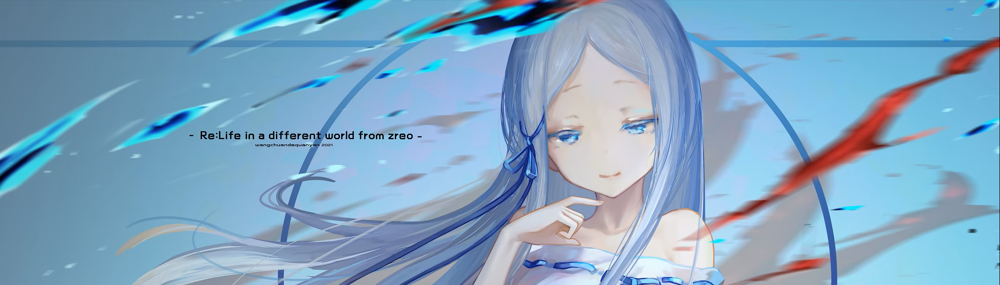
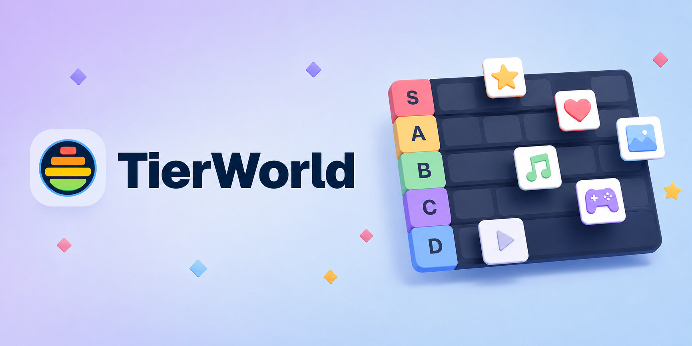
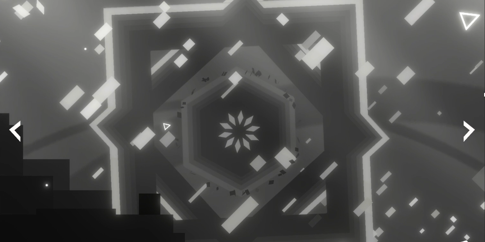

<!-- =========================
  Sylunae / 丝月
  GitHub Profile README
========================= -->

#  ⋆｡ﾟ☾ 丝月 Sylunae ☽｡ﾟ⋆

### 用技术构建自己的数字世界

> 愿热情永存，愿热爱不灭，愿生活无憾。

 

 

---

## ✦ 关于我

**全栈应用开发 · AI · 游戏开发 · 独立创作**

主要进行 Web 应用、独立产品、游戏与各类有趣项目的开发。

[个人网站](https://sylunae.vercel.app) ·
[博客](https://sylunae-blog.vercel.app) ·
[Portfolio](https://sylunae.vercel.app/portfolio) ·
[委托 / Services](https://sylunae.vercel.app/commissions)

<!-- <table>
<tr>
<td width="50%" align="center">

</td>

<td width="50%" align="center">

</td>
</tr>

<tr>
<td width="50%" align="center">

</td>

<td width="50%" align="center">

</td>
</tr>

<tr>
<td width="50%" align="center">

</td>

<td width="50%" align="center">

</td>
</tr>
</table> -->

---

## ✦ Tech Stack

### ◇ Languages

### ◇ Web & Frontend

### ◇ Backend & Database

### ◇ Cloud & DevOps

### ◇ Game Development

---

## ✦ Featured Projects

<table>
<tr>
<td width="50%" valign="top">

### Tierworld

高级 Tier List 创建、整理、评论与分享工具。

[Website](https://tierworld.app)

</td>

<td width="50%" valign="top">

### DreamCho 梦迴

原创 2D 平台动作 / Roguelike 游戏项目。

[介绍](https://sylunae.vercel.app/portfolio/projects/dreamcho)

</td>
</tr>
</table>
---

## ✦ GitHub Stats

<!--
未来可以把上面的第三方 Stats 替换成你自己的动态 SVG。

例如：

-->

---

## ✦ Links

 

---

**把有意思的想法变成现实**

